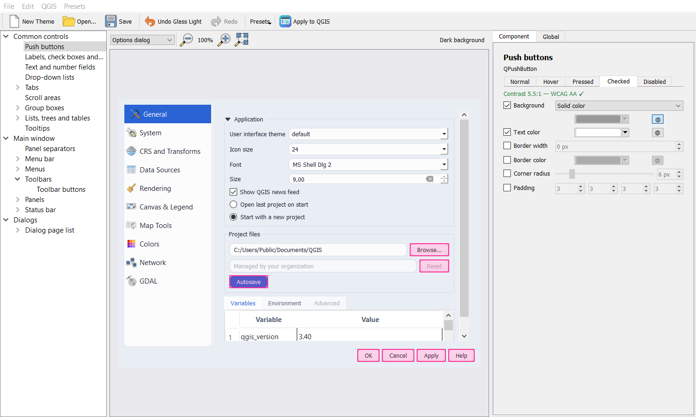
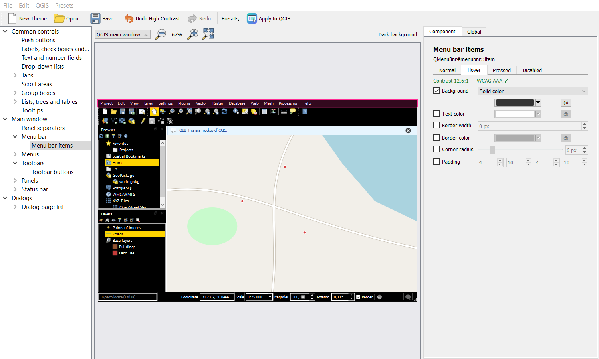
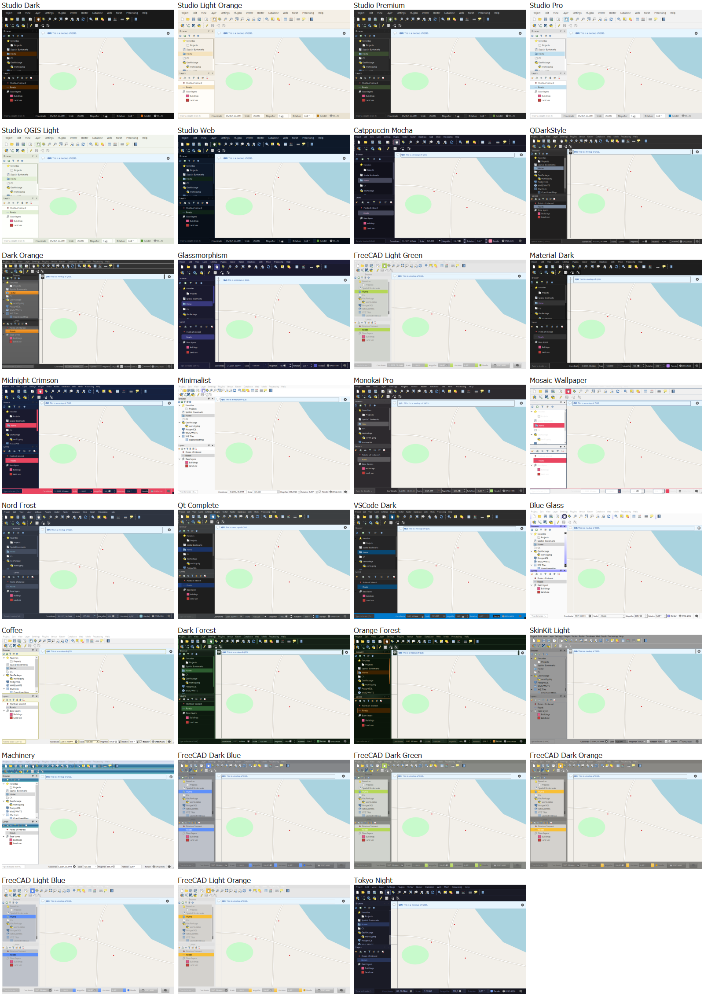

# QUI - Quantum User Interfaces

**A visual theme editor for the QGIS user interface.** Click any part of a live QGIS
mockup, restyle it, and apply the result to QGIS. If a theme turns out unreadable,
QUI reverts it automatically after 15 seconds.

[Türkçe](README.tr.md) · [Changelog](CHANGELOG.md) · [Releases](https://github.com/kaanklcrsln/QUI/releases)

## Features

- **Click-to-style mockup.** The mockup covers the QGIS main window (menus, toolbars,
  Layers and Browser panels, status bar) and an Options-style dialog. It is built
  from the same Qt classes and object names as QGIS, so what you see is what QGIS
  gets. The component tree on the left reaches parts that are hard to click.
- **Per-state styling** for normal, hover, pressed, selected, checked and disabled:
  - background (solid or gradient),
  - text and border colors (with opacity),
  - border width, corner radius and padding.
- **Global settings:**
  - an accent color that linked colors follow,
  - background opacity,
  - a corner radius you can spread to styled components,
  - the base QGIS theme,
  - the **program font** (installed fonts only).
- **Safe apply.**
  - "Apply to QGIS" shows a 15-second *Keep changes / Revert* countdown.
  - Anything but an explicit *Keep* reverts: timeout, Esc, Enter or closing it.
  - **Plugins → QUI → Restore Original QGIS Look** brings back the exact
    original stylesheet and font at any time. Disabling or uninstalling QUI does
    the same.
  - QUI never changes QGIS's own settings.
- **Accessibility.** A live WCAG contrast ratio is shown for text on background,
  with a warning below AA (4.5:1). All bundled presets pass AA.
- **Themes.**
  - Undo/redo.
  - Save and open `.qui.json` files.
  - Presets: Glass Dark, Glass Light, Minimal and High Contrast.
  - Export as a regular **QGIS UI theme**, selectable in *Settings → Options →
    General → UI Theme* without QUI.
  - Export as a `.qss` stylesheet.
  - Optionally re-apply the kept theme when QGIS starts.
- **Languages:** English and Turkish.

- **31 community themes**, bundled with credit to their authors. Pick one in
  *Presets → Community Themes* or use it as the base theme in the *Global* tab and
  restyle it further.

| Glass Light, Options dialog | High Contrast, WCAG indicator |
|---|---|
|  |  |

## Installation

**From the QGIS plugin repository:** *Plugins → Manage and Install Plugins → All*,
search for **QUI**. While QUI is marked experimental, first enable *Settings → Show
also experimental plugins* in the same window.

**From the QUI repository.** New versions appear here immediately.

1. *Plugins → Manage and Install Plugins → Settings → Add…*
2. Enter any name and the URL
   `https://raw.githubusercontent.com/kaanklcrsln/QUI/main/repository/plugins.xml`
3. Enable *Show also experimental plugins*.
4. Install **QUI - Quantum User Interfaces** from *All*.

**From a zip:** download `qui-x.y.z.zip` from
[Releases](https://github.com/kaanklcrsln/QUI/releases), then use *Plugins → Manage
and Install Plugins → Install from ZIP*.

## Usage

1. Open **Plugins → QUI → QUI Theme Editor…** or use the toolbar icon.
2. Pick a preset from **Presets** or start from your current QGIS theme.
3. Click a part of the mockup and edit it in the **Component** tab.
   - Tick a property to set it; untick it to fall back to the base theme.
   - Switch the state tabs to style hover, selected and other states.
   - **@** links a color to the accent.
4. Use the **Global** tab for the accent, opacity, base theme and program font.
5. Choose **Apply to QGIS**, then **Keep changes** within 15 seconds.
6. Save with *File → Save* or export with *File → Export as QGIS Theme…*.

## Community themes

QUI bundles these openly licensed QGIS and Qt stylesheet themes. Each one was imported
from a pinned upstream commit and converted into a regular QGIS theme folder, with its
image paths rewritten. Every theme's source, author and
license is listed in [qui/themes/themes.json](qui/themes/themes.json). The license
texts are in [qui/themes/licenses](qui/themes/licenses).

| Source | Author | License | Themes |
|---|---|---|---|
| [QGIS Studio Themes](https://github.com/GallPeters/qgis-studio-themes) | Jossef Kanter | GPL-2.0 | Studio Dark, Light Orange, Premium, Pro, QGIS Light, Web |
| [Load QSS - UI themes](https://github.com/All4Gis/Load-QSS) | Francisco Raga (All4Gis) and contributors | GPL-3.0 | Catppuccin Mocha, Dark Orange, Glassmorphism, Material Dark, Midnight Crimson, Minimalist (Steven Kay), Monokai Pro, Mosaic Wallpaper, Nord Frost, Qt Complete, VSCode Dark |
| ↳ QDarkStyle | Colin Duquesnoy | LGPL-3.0 | QDarkStyle |
| ↳ FreeCAD stylesheets | Pablo Gil Fernández | CC BY-SA 4.0 | FreeCAD Light Green |
| [SkinKit](https://github.com/Wolren/SkinKit) | Wolren | GPL-3.0 | Blue Glass (Steven Kay), Dark Forest, Orange Forest, SkinKit Light |
| ↳ FreeCAD stylesheets | Pablo Gil Fernández | CC BY-SA 4.0 | FreeCAD Dark Blue, Dark Green, Dark Orange, Light Blue, Light Orange |
| ↳ qmc2-machinery | René Reucher | GPL-2.0 | Machinery |
| ↳ Qt style sheet example | The Qt Company | BSD-3-Clause | Coffee |
| [Tokyo Night Theme](https://github.com/Monocromatic/qgis-tokyo-night-theme) | Lucas Mourão | MIT | Tokyo Night |

Some themes were written for other Qt applications, so not every QGIS widget
follows them. A few of them (QDarkStyle, Dark Orange, SkinKit Light) refer to
images from their original applications that QGIS does not have. The manifest
lists these images.

## Known limitations

- **No real blur.** Qt Style Sheets have no `backdrop-filter`, so the "glass"
  presets use translucent colors and gradients.
- **Some QGIS widgets set their own stylesheet**, which always beats an application
  theme. This affects the message bar, whose colors depend on the message level,
  and the status-bar coordinate box. QUI can only partly restyle these.
- **Native parts in dark themes.** Scroll bars, tree expand arrows and the
  drop-down arrow box keep their native look.
- **Third-party plugins** and some native dialogs may not follow every rule.
- **The preview can differ from the active theme.** If the chosen base theme
  differs from the one QGIS runs, properties neither defines come from the
  running theme in the preview.
- **Exported QGIS themes carry no font.** QGIS themes cannot set one.

## Compatibility

| QGIS | Qt | Status |
|---|---|---|
| 3.40 LTR, Windows | Qt 5.15 | Tested, including real apply/restore and install from zip |
| 3.28 – 3.44 | Qt 5.15 | Supported; automated tests run on 3.40 (Linux) in CI |
| 4.x | Qt 6 | Supported (`qgisMaximumVersion=4.99`). The automated tests pass on QGIS 4.2 in CI. Not yet tried on the QGIS 4 desktop app. |

On QGIS 4, *Export as QGIS Theme* writes the theme to `QgsApplication.userThemesFolder()`.
In the headless QGIS 4.2 test environment, QGIS lists no user themes at all, not even
a copy of a built-in one. Whether the desktop app lists them is not verified yet.
Reports are welcome.

## Building from source

- Release zip: `python scripts/package.py` writes `dist/qui-<version>.zip`. It needs only
  Python.
- Live reload: `python scripts/dev_link.py` links `qui/` into your QGIS profile. Use it
  with [Plugin Reloader](https://plugins.qgis.org/plugins/plugin_reloader/).
- Standalone editor (Windows): `scripts\dev.bat python scripts\run_standalone.py`

Bug reports and ideas are welcome in [Issues](https://github.com/kaanklcrsln/QUI/issues).

## License

QUI's code is GPL-2.0-or-later; see [LICENSE](LICENSE). The bundled community themes
keep their own licenses, listed above. Because some of them are GPL-3.0, the plugin as
a whole is distributed under the terms of GPL-3.0, which "or later" allows.
