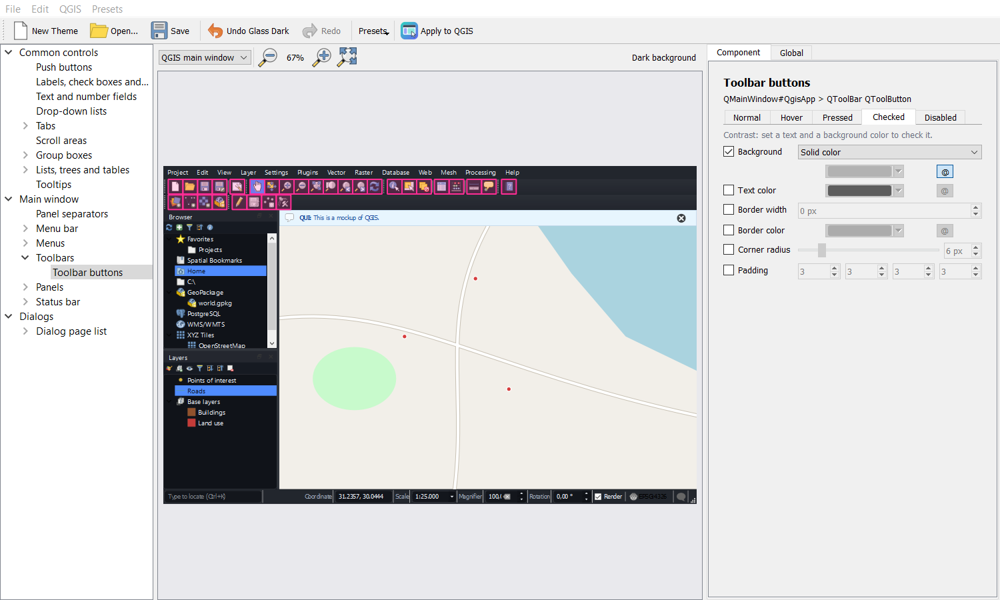

# QUI - Quantum User Interfaces

**QGIS arayüzü için görsel tema editörü.** Canlı bir QGIS maketinde herhangi bir
parçaya tıklayın, stilini değiştirin ve sonucu QGIS'e uygulayın. Tema okunaksız
çıkarsa QUI 15 saniye sonra kendiliğinden geri alır.

[English](README.md) · [Değişiklikler](CHANGELOG.md) · [Katkı](CONTRIBUTING.md)

## Özellikler

- **Tıklayarak stillendirme.**
  - Maket, QGIS ana penceresini (menüler, araç çubukları, Katmanlar ve Tarayıcı
    panelleri, durum çubuğu) ve Seçenekler tarzı bir pencereyi içerir.
  - Maket, QGIS ile aynı Qt sınıfları ve nesne adlarıyla kurulduğu için gördüğünüz
    sonuç QGIS'te de aynı olur.
  - Soldaki bileşen ağacı, tıklaması zor parçalara da ulaşır.
- **Durum bazında stil:** normal, üzerinde, basılı, seçili, işaretli ve pasif
  durumların her biri için:
  - arka plan (düz renk ya da gradyan),
  - metin ve kenarlık rengi (saydamlıkla),
  - kenarlık kalınlığı, köşe yuvarlaklığı ve iç boşluk.
- **Global ayarlar:**
  - bağlı renklerin izlediği bir vurgu rengi,
  - arka plan opaklığı,
  - biçimlendirilmiş bileşenlere yayılabilen bir köşe yuvarlaklığı,
  - taban QGIS teması,
  - **program fontu** (yalnızca kurulu fontlar).
- **Güvenli uygulama.**
  - "QGIS'e Uygula", 15 saniyelik *Değişiklikleri koru / Geri al* geri sayımı gösterir.
  - Açık bir *Koru* tıklaması dışında her şey geri alır: süre dolması, Esc, Enter
    ya da pencereyi kapatmak.
  - **Eklentiler → QUI → Orijinal QGIS Görünümünü Geri Yükle**, orijinal stil
    sayfasını ve fontu her an birebir geri getirir. Eklentiyi kapatmak veya
    kaldırmak da aynısını yapar.
  - QUI, QGIS'in kendi ayarlarını asla değiştirmez.
- **Erişilebilirlik.** Metin ve arka plan için canlı WCAG kontrast oranı gösterilir;
  oran AA'nın (4.5:1) altına düşerse uyarı verilir. Tüm hazır temalar AA'yı geçer.
- **Temalar.**
  - Geri al / yinele.
  - `.qui.json` dosyalarını kaydetme ve açma.
  - Hazır temalar: Glass Dark, Glass Light, Minimal ve High Contrast.
  - Normal bir **QGIS arayüz teması** olarak dışa aktarma; *Ayarlar → Seçenekler →
    Genel → Arayüz Teması*'ndan QUI olmadan seçilebilir.
  - `.qss` stil sayfası olarak dışa aktarma.
  - İsterseniz korunan tema QGIS her açıldığında yeniden uygulanır.
- **Diller:** Türkçe ve İngilizce.

## Kurulum

**QGIS eklenti deposundan:** *Eklentiler → Eklentileri Yönet ve Kur → Tümü*
sekmesinde **QUI** diye aratın. QUI deneysel olarak işaretliyken, önce aynı
penceredeki *Ayarlar → Deneysel eklentileri de göster* seçeneğini açın.

**QUI deposundan.** Yeni sürümler burada hemen görünür.

1. *Eklentiler → Eklentileri Yönet ve Kur → Ayarlar → Ekle…*
2. Herhangi bir ad ve şu adresi girin:
   `https://raw.githubusercontent.com/kaanklcrsln/QUI/main/repository/plugins.xml`
3. *Deneysel eklentileri de göster* seçeneğini açın.
4. *Tümü* sekmesinden **QUI - Quantum User Interfaces** eklentisini kurun.

**Zip'ten:** [Releases](https://github.com/kaanklcrsln/QUI/releases) sayfasından
`qui-x.y.z.zip` dosyasını indirin, ardından *Eklentiler → Eklentileri Yönet ve Kur →
ZIP'ten Kur* seçeneğini kullanın.

## Kullanım

1. **Eklentiler → QUI → QUI Tema Editörü…** menüsünü ya da araç çubuğu simgesini kullanın.
2. **Hazır Temalar**'dan birini seçin ya da mevcut QGIS temanızdan başlayın.
3. Makette bir parçaya tıklayın ve **Bileşen** sekmesinde düzenleyin.
   - Bir özelliği uygulamak için işaretleyin; işareti kaldırınca taban tema geçerli olur.
   - Üzerinde, seçili ve diğer durumları stillendirmek için durum sekmelerini değiştirin.
   - **@** düğmesi bir rengi vurgu rengine bağlar.
4. Vurgu rengi, opaklık, taban tema ve program fontu için **Global** sekmesini kullanın.
5. **QGIS'e Uygula**'yı seçin, ardından 15 saniye içinde **Değişiklikleri koru**'ya tıklayın.
6. *Dosya → Kaydet* ile kaydedin ya da *Dosya → QGIS Teması Olarak Dışa Aktar…* ile dışa aktarın.

## Bilinen sınırlamalar

- **Gerçek bulanıklık (blur) yok.** Qt stil sayfalarında `backdrop-filter` yok; bu
  yüzden "glass" temaları yarı saydam renkler ve gradyanlar kullanır.
- **Bazı QGIS widget'ları kendi stil sayfasını yazar** ve bu her zaman uygulama
  temasından üstün gelir. Bu durum, rengi mesaj seviyesine göre değişen mesaj
  çubuğunu ve durum çubuğundaki koordinat kutusunu etkiler. QUI bunları ancak
  kısmen stillendirebilir.
- **Koyu temalarda yerel görünüm kalan parçalar.** Kaydırma çubukları, ağaçtaki
  açma okları ve açılır listenin ok kutusu yerel görünümlerini korur.
- **Üçüncü taraf eklentiler** ve bazı yerel pencereler her kurala uymayabilir.
- **Önizleme etkin temadan farklı olabilir.** Seçilen taban tema QGIS'in çalıştığı
  temadan farklıysa, ikisinin de tanımlamadığı özellikler önizlemede çalışan
  temadan gelir.
- **Dışa aktarılan QGIS temaları font içermez.** QGIS temaları font ayarlayamaz.

## Uyumluluk

| QGIS | Qt | Durum |
|---|---|---|
| 3.40 LTR, Windows | Qt 5.15 | Test edildi; gerçek uygula/geri yükle ve zip'ten kurulum dahil |
| 3.28 – 3.44 | Qt 5.15 | Destekleniyor; otomatik testler CI'da 3.40 (Linux) üzerinde çalışır |
| 4.x | Qt 6 | Destekleniyor (`supportsQt6=True`). Otomatik testler CI'da QGIS 4.2 üzerinde geçiyor. QGIS 4 masaüstü uygulamasında henüz denenmedi. |

QGIS 4'te *QGIS Teması Olarak Dışa Aktar*, temayı `QgsApplication.userThemesFolder()`
klasörüne yazar. Başsız (headless) QGIS 4.2 test ortamında QGIS hiçbir kullanıcı
temasını listelemiyor; yerleşik bir temanın kopyası bile listede çıkmıyor. Masaüstü
uygulamasının bu temaları listeleyip listelemediği henüz doğrulanmadı. Geri
bildirimleriniz memnuniyetle karşılanır.

## Lisans

GPL-2.0-or-later. Ayrıntılar için [LICENSE](LICENSE).
